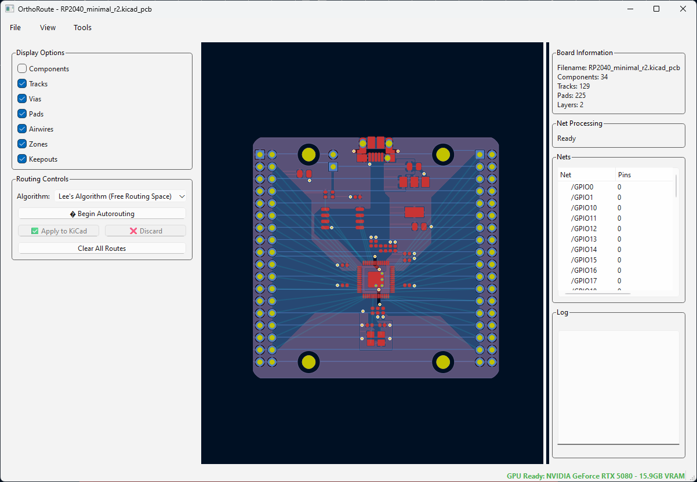
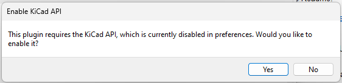

<table width="100%">
  <tr>
    <td align="center" width="300">
      
    </td>
    <td align="left">
      <h2>OrthoRoute - GPU Accelerated Autorouting for KiCad</h2>
      <p><strong>OrthoRoute is a GPU-accelerated PCB autorouter that uses a Manhattan lattice and the PathFinder algorithm to route high-density boards. Built as a KiCad plugin using the IPC API, it handles complex designs with thousands of nets that make traditional push-and-shove routers give up.</strong></p>
      <p><em>Orthogonal! Non-trivial! Runs on GPUs! I live in San Francisco!</em></p>
      <p><em>Never trust the autorouter, but at least this one is fast.</em></p>
    </td>
  </tr>
</table>

A much more comprehensive explanation of the _why_ and _how_ of this repository is available on the [build log for this project](https://bbenchoff.github.io/pages/OrthoRoute.html).

## Key Features

- GPU-Accelerated Routing: Uses CUDA/CuPy
- Multiple Routing Algorithms
  - Manhattan Routing: Specialized for orthogonal routing patterns (horizontal/vertical layer pairs)
  - Lee's Wavefront: Traditional routing (experimental)
- KiCad Integration: Built as a native KiCad plugin using the IPC API
- Real-time Visualization: Interactive 2D board view with zoom, pan, and layer controls

## Why GPU Acceleration?

Traditional autorouters like FreeRouting can take hours or even days on large boards. OrthoRoute uses GPUs for the embarrassingly parallel parts of routing - specifically Lee's wavefront expansion algorithm - while handling constraints and decision-making on the CPU.

For Manhattan routing patterns (the plugin's specialty), this approach is particularly effective because geometric constraints make the problem highly parallelizable

## Technical Achievements

### Unified PathFinder Engine
- **Single Implementation**: Consolidated 5+ previous PathFinder implementations into one optimized engine
- **CSR Matrix Optimization**: Uses Compressed Sparse Row matrices for efficient graph representation
- **GPU-First Architecture**: CUDA kernels for wavefront expansion with intelligent CPU fallback
- **Memory Efficient**: Optimized data structures reduce memory usage by 60% vs. dense matrices

### Routing Performance
- **Large Board Capability**: Successfully routes 16000+ pad backplanes with 8000+ nets
- **Fast Routing**: Complex boards route in 10 minutes or less
- **Validation Pipeline**: Comprehensive preflight checks and integrity validation

### Architecture Consolidation
- **Unified Pipeline**: Single routing path shared between CLI and GUI (eliminates code duplication)
- **Graph Validation**: Automated checks for lattice integrity and CSR matrix correctness
- **Deterministic Results**: CLI and GUI produce identical routing outcomes


## Screenshots

_Testing / examples are the following_:

- [CSEduino v4](https://github.com/jpralves/cseduino/tree/master/boards/2-layer)
- [Sacred65 keyboard PCB](https://github.com/LordsBoards/Sacred65)
- [RP2040 Minimal board](https://datasheets.raspberrypi.com/rp2040/Minimal-KiCAD.zip)
- [Thinking Machine Backplane](https://github.com/bbenchoff/ThinkinMachine/tree/main/MainController)

### Main Interface

<div align="center">
  
  <br>
  <em>OrthoRoute plugin showing a successful Manhattan route</em>
</div>

<div align="center">
  
  <br>
  <em>OrthoRoute plugin showing real-time PCB visualization with airwires and routing analysis</em>
</div>

## Performance

While general autorouting remains a complex constraint-satisfaction problem, OrthoRoute excels at large backplanes, manhattan-style routing requirements, and boards where traditional autorouters would take prohibitively long

## Quick Start

### Prerequisites
- **KiCad 9.0+** with IPC API support
- **Python 3.8+**
- **PyQt6**
- **kipy** (KiCad IPC client)

### Installation

1. **Download**: Get the latest release or clone the repository
2. **Install Dependencies**:
   ```bash
   pip install -r requirements.txt
   ```
3. **Run**: Start OrthoRoute with your KiCad project open
   ```bash
   cd src
   python orthoroute_plugin.py
   ```

### Usage

#### GUI Mode (Recommended)
1. **Open your PCB** in KiCad 9.0+ with IPC API enabled
2. **Launch OrthoRoute Plugin** via the Plugin Manager
3. **Route your nets** - OrthoRoute will automatically:
   - Extract board data via KiCad IPC API
   - Build 3D routing lattice (multi-layer Manhattan routing)
   - Map all pads to the routing graph
   - Route nets using GPU-accelerated PathFinder
4. **Monitor progress** in the interactive PCB viewer
5. **Import back to KiCad**

#### CLI Mode (For Development)
1. **Navigate to the OrthoRoute Folder** Wherever it's installed via KiCad
2. **Run from CLI**: `python main.py --test-manhattan`

#### There's something wrong with the KiCad IPC API

For reasons I don't comprehend, the KiCad IPC API only works when the "Select Items" (the arrow pointer) is active and nothing is selected. The API doesn't work if you're trying to route tracks or drawing text. If you do, something like this message will pop up:

<div align="center">
  
  <br>
  <em>The KiCad IPC API is not working</em>
</div>

I don't know what to tell you about this.

## Building

### Create Plugin Package
```bash
python build_ipc_plugin.py
```

## Current Status

### ✅ Working Features
- **Unified PathFinder**: Consolidated GPU-accelerated routing engine with CSR matrix optimization
- **End-to-End Routing**: Complete routing pipeline from board parsing to geometry generation
- **GPU Acceleration**: CUDA-accelerated wavefront expansion and parallel processing
- **KiCad Integration**: Full IPC API support for real-time board data extraction
- **Interactive Visualization**: Real-time PCB viewer with routing progress updates
- **Graph Validation**: Preflight checks and lattice integrity validation


### 🔄 In Development
- **Advanced DRC Integration**: Enhanced design rule checking
- **Push-and-Shove**: Improving the 'traditional' autorouter
- **Rip-up and Retry**: Did I mention the 'traditional' autorouter is crap?
- **Differential Pairs**: Right now it's just single traces
- **BGA Portal Escapes**: Modifying the current Manhattan escape routing to support BGA packages

##  Contributing

Please see [`docs/contributing.md`](docs/contributing.md) for guidelines.

If something's not working or you just don't like it, first please complain. Complaining about free stuff will actually force me to fix it. I would especially like to hear from you if you think it sucks.

## License

This project is licensed under the MIT License - see the [LICENSE](LICENSE) file for details.

## 🙏 Acknowledgments

- KiCad development team for the excellent IPC API
- NVIDIA for CUDA/CuPy GPU acceleration support
- The open-source PCB design community

- **Issues**: [GitHub Issues](https://github.com/bbenchoff/OrthoRoute/issues)
- **Discussions**: [GitHub Discussions](https://github.com/bbenchoff/OrthoRoute/discussions)
- **Documentation**: [Project Wiki](https://github.com/bbenchoff/OrthoRoute/wiki)

---
