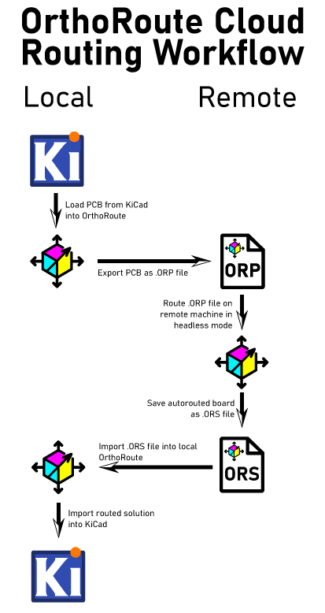

<table width="100%">
  <tr>
    <td align="center" width="300">
      
    </td>
    <td align="left">
      <h2>OrthoRoute - GPU Accelerated Autorouting for KiCad</h2>
      <p><strong>OrthoRoute is a GPU-accelerated PCB autorouter that uses a Manhattan lattice and the PathFinder algorithm to route high-density boards. Built as a KiCad plugin using the IPC API, it handles complex designs with thousands of nets that make traditional push-and-shove routers give up.</strong></p>
      <p><em>Orthogonal! Non-trivial! Runs on GPUs! I live in San Francisco!</em></p>
      <p><em>Never trust the autorouter, but at least this one is fast. </em></p>
    </td>
  </tr>
</table>

A much more comprehensive explanation of the _WHY_ and _HOW_ of this repository is available on the [build log for this project](https://bbenchoff.github.io/pages/OrthoRoute.html).

## Videos

<table>
  <tr>
    <td align="center" width="33%">
      <a href="https://www.youtube.com/watch?v=KXxxNQPTagA">
        
        <br/>
        <b>OrthoRoute Overview</b>
      </a>
    </td>
    <td align="center" width="33%">
      <a href="https://www.youtube.com/watch?v=P8Wsej71XAQ">
        
        <br/>
        <b>Algorithm Demonstration</b>
      </a>
    </td>
    <td align="center" width="33%">
      <a href="https://www.youtube.com/watch?v=j_XJNxEXXkQ">
        
        <br/>
        <b>PathFinder Net Tour</b>
      </a>
    </td>
  </tr>
</table>

## What Is Orthoroute?

OrthoRoute is a KiCad autorouter for _exceptionally large_ or _very complex_ backplane designs and BGA escape patterns. The simplified idea behind this algorithm is, "put all your parts on the top layer, and on layers below that, create a grid of traces. Only horizontal traces on layer 1, only vertical traces on layer 2, and continue like that for all the other layers. Route through this 'Manhattan grid' of traces with blind and buried vias".

The algorithm used for this autorouter is [PathFinder: a negotiation-based performance-driven router for FPGAs](https://dl.acm.org/doi/10.1145/201310.201328). My implementation of PathFinder treats the PCB as a graph: nodes are intersections on an x–y grid where vias can go, and edges are the segments between intersections where copper traces can run. Each edge and node is treated as a shared resource.

PathFinder is iterative. In the first iteration, all nets (airwires) are routed _greedily_, without accounting for overuse of nodes or edges. Subsequent iterations account for congestion, increasing the “cost” of overused edges and ripping up the worst offenders to re-route them. Over time, the algorithm _converges_ to a PCB layout where no edge or node is over-subscribed by multiple nets.

With this architecture -- the PathFinder algorithm on a very large graph, within the same order of magnitude of the largest FPGAs -- it makes sense to run the algorithm with GPU acceleration. There are a few factors that went into this decision:

1. Everyone who's routing giant backplanes probably has a gaming PC. Or you can rent a GPU from whatever company is advertising on MUNI bus stops this month.
2. The PathFinder algorithm requires hundreds of billions of calculations for every iteration, making single-core CPU computation glacially slow. 
3. With CUDA, I can implement a SSSP (parallel Dijkstra) to find a path through a weighted graph very fast. 

Note this is _not_ a fully parallel autorouter; in OrthoRoute, nets are still routed in sequence on a shared congestion map. The parallelism lives inside the shortest-path search: a CUDA SSSP (“parallel Dijkstra”) kernel makes each individual net’s pathfinding fast, but it doesn’t route many nets simultaneously.

## Features

- KiCad Integration: Built as a native KiCad plugin using the IPC API
- GPU-Accelerated Routing: Uses CUDA/CuPy
- Multiple Routing Algorithms
  - Manhattan Routing: Specialized for orthogonal routing patterns (horizontal/vertical layer pairs)
  - Lee's Wavefront: Traditional routing (experimental)
- Real-time Visualization: Interactive 2D board view with zoom, pan, and layer controls
- Checkpoint system for instant resume after crashes (experimental)
- Headless (Cloud) Routing: Rent an A100 GPU in some datacenter

## Screenshots

_Testing / examples are the following_:

- [CSEduino v4](https://github.com/jpralves/cseduino/tree/master/boards/2-layer)
- [Sacred65 keyboard PCB](https://github.com/LordsBoards/Sacred65)
- [RP2040 Minimal board](https://datasheets.raspberrypi.com/rp2040/Minimal-KiCAD.zip)
- [Really Complex Backplane](https://github.com/bbenchoff/OrthoRoute/TestBoards)

### Main Interface

<div align="center">
  
  <br>
  <em>OrthoRoute plugin showing a successful Manhattan route</em>
</div>

<div align="center">
  
  <br>
  <em>OrthoRoute plugin showing real-time PCB visualization with airwires and routing analysis</em>
</div>

## Quick Start

### Prerequisites
- **KiCad 9.0+** with IPC API support
- **Python 3.12+**
- **PyQt6**
- **kipy** (KiCad IPC client)

### Installation

1. **Download**: Get the latest release or clone the repository
2. **Install Dependencies**:
   ```bash
   pip install -r requirements.txt
   ```
3. **Run**: Start OrthoRoute with your KiCad project open
   ```bash
   cd src
   python main.py
   ```

## Will it work with _my_ GPU?

On larger boards with many layers, the memory requirements for OrthoRoute become excessive. As an example, I'll show what is needed for the reason I built this: a 200x200mm board with 32 layers. This is a _very_ large graph, within an order of magnitude of the largest FPGAs available. 

| Board Specs | → | Lattice Size |
|-------------|---|--------------|
| 200mm × 200mm | → | 500 × 500 nodes |
| Grid pitch: 0.4mm | → | (200 ÷ 0.4 = 500) |
| Layers: 32 | → | Z dimension: 32 |
| **Result** | → | **8,000,000 nodes** |

Total nodes: 500 × 500 × 32 = **8,000,000 nodes**
Edges: ~8M nodes × 6 neighbors = **~48 million edges**

#### Memory requirements:

PathFinder stores multiple arrays per edge (distance, parent, cost, history, present usage, etc.):
 - ~48M edges × 32 bytes per edge = 1.5 GB per array
 - × 8 arrays (distance, parent, cost, history, present, capacity, etc.)
 - = ~12 GB base

Plus graph structure, node ownership, buffers: +20-25 GB

**GPU Recommendations:**

| Board Size | Layers | Grid Pitch | Nodes | VRAM Needed | GPU Required |
|------------|--------|------------|-------|-------------|--------------|
| 100×100mm | 6 | 0.4mm | 375k | 8-12 GB | RTX 3080, RTX 4070 |
| 150×150mm | 18 | 0.4mm | 2.53M | 18-24 GB | RTX 4090 |
| 200×200mm | 18 | 0.4mm | 4.5MM | 24-30 GB | RTX 6000 Ada (48GB) |
| 200×200mm | 32 | 0.4mm | 8M | 35-40 GB| A100 80GB, H100 |
| 300×300mm | 32 | 0.4mm | 18M | 60-80 GB | H100 80GB |

**Rule of thumb:**
 - Calculate nodes: (board_width_mm ÷ grid_pitch_mm) × (board_height_mm ÷ grid_pitch_mm) × num_layers
 - Estimate VRAM: nodes ÷ 200,000 = GB needed (conservative estimate)
 - Example: 8M nodes ÷ 200,000 = 40 GB minimum
 - This list of recommended GPUs is either going to be hilarious or sad in a decade

**Important distinction:**
- **VRAM usage** is determined by board dimensions, layers, and grid pitch (not net count)
- **Routing time** is determined by number of nets
- Example: 500 nets vs 8,000 nets on the same 200×200mm 20-layer board uses the **same VRAM** but takes **16x longer** to route

**If you get "Out of Memory" errors:** Rent a GPU with more VRAM or use `--cpu-only` mode (slower but no memory limit).

## Usage

### GUI Mode (Recommended)
1. **Open your PCB** in KiCad 9.0+ with IPC API enabled
2. **Launch OrthoRoute Plugin** via the Plugin Manager
3. **Route your nets** - OrthoRoute will automatically:
   - Extract board data via KiCad IPC API
   - Build 3D routing lattice (multi-layer Manhattan routing)
   - Map all pads to the routing graph
   - Route nets using GPU-accelerated PathFinder
4. **Monitor progress** in the interactive PCB viewer
5. **Import back to KiCad**

### CLI Mode (For Development)
1. **Navigate to the OrthoRoute Folder** Wherever it's installed via KiCad
2. **Run from CLI**: `python main.py --test-manhattan`

### Cloud (Headless, Kicad-less) Mode
Headless mode is designed for instances when you would like to route a board, but it won't fit in your GPU. This mode is actually several functions that allow for running a routing algorithm _without KiCad_.

<div align="center">
  
  <br>
  <em>Cloud routing workflow for running OrthoRoute on remote GPU instances</em>
  <br>
</div>

The workflow is three steps. First, export the PCB from the OrthoRoute plugin
1. Load a PCB in KiCad
2. Run the OrthoRoute plugin
3. Select `File -> Export PCB...` from the top menu
4. Save this file (with `.ORP` extension) to disk

Second, run OrthoRoute using the saved `.ORP` file:
  ```bash
  python main.py headless <your-board>.ORP

    Optional parameters:
  python main.py headless <board>.ORP --max-iterations 200    # Set max iterations (default: 200)
  python main.py headless <board>.ORP -o custom.ORS           # Specify output filename
  python main.py headless <board>.ORP --use-gpu               # Force GPU mode
  python main.py headless <board>.ORP --cpu-only              # Force CPU-only mode
  ```

Third, import the routing solution back into KiCad:
1. In the OrthoRoute plugin, select `File -> Import Solution...` (or press Ctrl+I)
2. Select the generated `.ORS` file
3. Review the routing in the preview window
4. Click "Apply to KiCad" to commit the traces and vias to your PCB

Typical use case: Cloud GPU routing

Upload your .ORP file to a cloud GPU instance (Vast.ai, RunPod, etc.), run the routing there, then download the .ORS file back to your local machine for import. This allows routing large boards on powerful GPUs with more memory. Details on the file format are available [in the docs](docs/ORP_ORS_file_formats.md)

### There's something wrong with the KiCad IPC API

For reasons I don't comprehend, the KiCad IPC API only works when the "Select Items" (the arrow pointer) is active and nothing is selected. The API doesn't work if you're trying to route tracks or drawing text. If you do, something like this message will pop up:

<div align="center">
  
  <br>
  <em>The KiCad IPC API is not working</em>
</div>

I don't know what to tell you about this. I'll start an issue with KiCad or something

## Building

### Create Plugin Package
```bash
python build.py
```
Install via Plugin Manager

## Current Status

### ✅ Working Features
- **Unified PathFinder**: Consolidated GPU-accelerated routing engine with CSR matrix optimization
- **End-to-End Routing**: Complete routing pipeline from board parsing to geometry generation
- **GPU Acceleration**: CUDA-accelerated wavefront expansion and parallel processing
- **KiCad Integration**: Full IPC API support for real-time board data extraction
- **Interactive Visualization**: Real-time PCB viewer with routing progress updates
- **Graph Validation**: Preflight checks and lattice integrity validation
- **Headless/Cloud Routing**: Route on a GPU in a datacenter somewhere


### 🔄 In Development
- **Advanced DRC Integration**: Enhanced design rule checking
- **Push-and-Shove**: Improving the 'traditional' autorouter
- **Rip-up and Retry**: Did I mention the 'traditional' autorouter is crap?
- **Differential Pairs**: Right now it's just single traces
- **BGA Portal Escapes**: Modifying the current Manhattan escape routing to support BGA packages

##  Contributing

Please see [`docs/contributing.md`](docs/contributing.md) for guidelines.

If something's not working or you just don't like it, first please complain. Complaining about free stuff will actually force me to fix it. I would especially like to hear from you if you think it sucks.

## License

This project is licensed under the MIT License - see the [LICENSE](LICENSE) file for details.

## 🙏 Acknowledgments

- KiCad development team for the excellent IPC API
- NVIDIA for CUDA/CuPy GPU acceleration support
- The open-source PCB design community

- **Issues**: [GitHub Issues](https://github.com/bbenchoff/OrthoRoute/issues)
- **Discussions**: [GitHub Discussions](https://github.com/bbenchoff/OrthoRoute/discussions)
- **Documentation**: [Project Wiki](https://github.com/bbenchoff/OrthoRoute/wiki)

---
