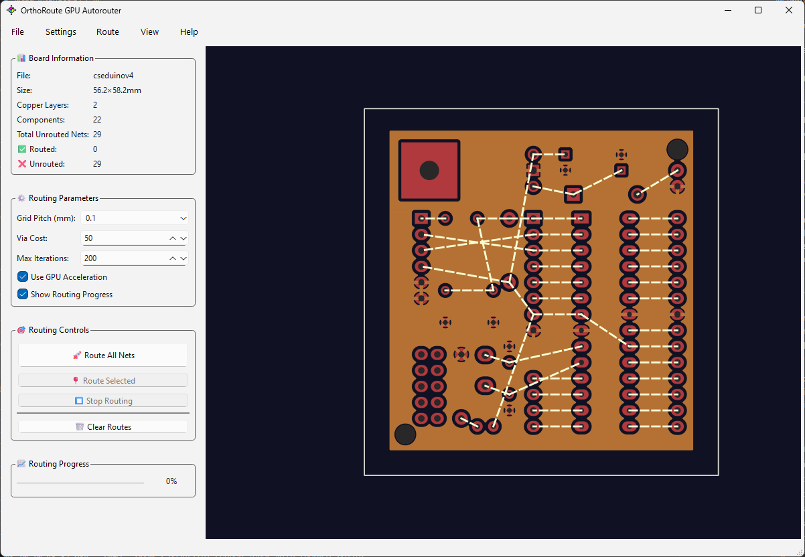

<table width="100%">
  <tr>
    <td align="center" width="300">
      
    </td>
    <td align="left">
      <h2>OrthoRoute - GPU Accelerated Autorouting for KiCad</h2>
      <p><em>You shouldn't trust the autorouter, but at least this one is faster</em></p>
    </td>
  </tr>
</table>

OrthoRoute is a GPU-accelerated PCB autorouter plugin for KiCad, designed to handle massive circuit boards that would be impractical to route by hand. Born out of necessity to route a backplane with 17,600 pads, OrthoRoute leverages CUDA cores to parallelize the most computationally intensive parts of PCB routing.

## Key Features

- GPU-Accelerated Routing: Uses CUDA/CuPy for wavefront expansion algorithms
- Manhattan Routing: Specialized for orthogonal routing patterns (horizontal/vertical layer pairs)
- KiCad Integration: Built as a native KiCad plugin using the IPC API
- Real-time Visualization: Interactive 2D board view with zoom, pan, and layer controls
- Multi-layer Support: Handles complex multi-layer PCB designs

## Why GPU Acceleration?

Traditional autorouters like FreeRouting can take hours or even days on large boards. OrthoRoute uses GPUs for the embarrassingly parallel parts of routing - specifically Lee's wavefront expansion algorithm - while handling constraints and decision-making on the CPU.

For Manhattan routing patterns (the plugin's specialty), this approach is particularly effective because:

- Traces follow predictable orthogonal patterns
- Each layer has a dedicated direction (horizontal or vertical)
- Geometric constraints make the problem highly parallelizable


## Screenshots

### Main Interface
<div align="center">
  
  <br>
  <em>OrthoRoute plugin showing real-time PCB visualization with airwires and routing analysis</em>
</div>

## Performance

While general autorouting remains a complex constraint-satisfaction problem, OrthoRoute excels at:

- Large backplanes with regular connector patterns
- Manhattan-style routing requirements
- Boards where traditional autorouters would take prohibitively long

## 🚀 Quick Start

### Prerequisites
- **KiCad 9.0+** with IPC API support
- **Python 3.8+**
- **PyQt6**
- **kipy** (KiCad IPC client)

### Installation

1. **Download**: Get the latest release or clone the repository
2. **Install Dependencies**:
   ```bash
   pip install -r requirements.txt
   ```
3. **Run**: Start OrthoRoute with your KiCad project open
   ```bash
   cd src
   python orthoroute_plugin.py
   ```

### Usage

1. **Open your PCB** in KiCad
2. **Launch OrthoRoute** - it will automatically connect via IPC
3. **Route your nets** using the enhanced autorouter
4. **Visualize results** with the interactive PCB viewer


## 🏗️ Project Structure

```
OrthoRoute/
├── src/                           # Source code
│   ├── core/                      # Core infrastructure
│   │   ├── drc_rules.py          # DRC rules management
│   │   ├── gpu_manager.py        # GPU acceleration
│   │   └── board_interface.py    # Board data abstraction
│   ├── routing_engines/           # Pluggable routing algorithms
│   │   ├── base_router.py        # Abstract router interface
│   │   └── lees_router.py        # Lee's wavefront implementation
│   ├── data_structures/           # Common data structures
│   ├── autorouter_factory.py     # Main factory interface
│   ├── orthoroute_plugin.py      # Plugin entry point
│   ├── orthoroute_window.py      # UI components
│   └── kicad_interface.py        # KiCad integration
├── docs/                          # Documentation
├── graphics/                      # Icons and screenshots
├── tests/                         # Test suite
└── build/                         # Build artifacts
```

## 🏗️ Building

### Create Plugin Package
```bash
python build_ipc_plugin.py
```

### Development Build
```bash
python build.py --package development
```


## Current Status

### Production Ready
- **Enhanced Autorouter**: Professional-grade routing with DRC compliance
- **GPU Acceleration**: Batch processing and massive parallelization
- **KiCad Integration**: Full IPC API support for real-time board data
- **Interactive Visualization**: Complete PCB viewer with layer controls

### In Development  
- **Manhattan Routing**: Orthogonal routing algorithm
- **A* Pathfinding**: Heuristic-guided routing
- **Advanced Features**: Push-and-shove, differential pairs

##  Contributing

We welcome contributions! Please see [`docs/contributing.md`](docs/contributing.md) for guidelines.

If something's not working or you just don't like it, first please complain. Complaining about free stuff will actually force me to fix it.

## 📄 License

This project is licensed under the MIT License - see the [LICENSE](LICENSE) file for details.

## 🙏 Acknowledgments

- KiCad development team for the excellent IPC API
- NVIDIA for CUDA/CuPy GPU acceleration support
- The open-source PCB design community

- **Issues**: [GitHub Issues](https://github.com/bbenchoff/OrthoRoute/issues)
- **Discussions**: [GitHub Discussions](https://github.com/bbenchoff/OrthoRoute/discussions)
- **Documentation**: [Project Wiki](https://github.com/bbenchoff/OrthoRoute/wiki)

## Roadmap

- [ ] Advanced routing algorithms (push-and-shove, differential pairs)
- [ ] PCB stackup awareness and layer-specific routing
- [ ] Design rule checking integration
- [ ] Batch routing for multiple PCBs
- [ ] Machine learning route optimization
- [ ] Integration with external routing services

---

**OrthoRoute** - Professional PCB autorouting for KiCad with modern GPU acceleration and official API integration.